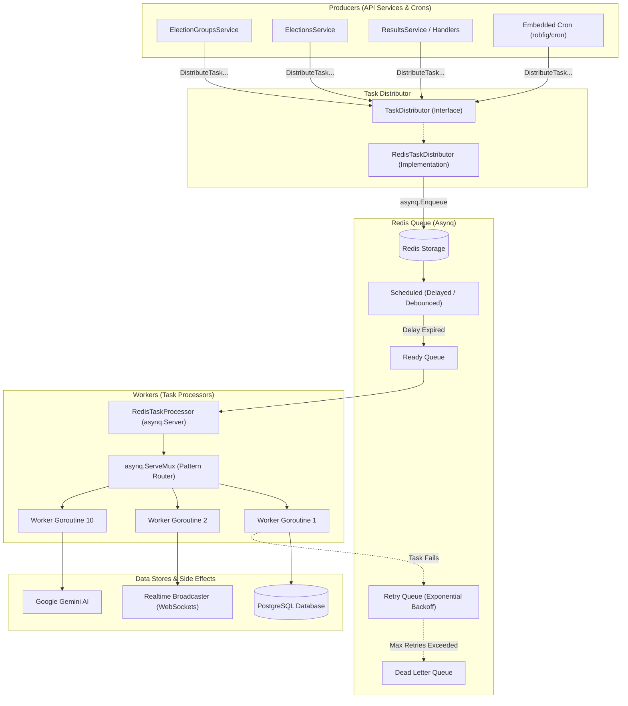

# Free9ja Worker & Queue Architecture

This document provides a comprehensive technical overview of the asynchronous task processing system in `apps/api/internal/worker`.

---

## 1. High-Level Architecture

The system implements the **Producer-Consumer Pattern** backed by [Hibiken Asynq](https://github.com/hibiken/asynq) and Redis:



---

## 2. The Three Core Pillars

### Pillar 1: The Distributor (`TaskDistributor`)
- **Role**: The **Producer**. Enqueues jobs into Redis without executing the business logic.
- **Why an Interface?**
  - Allows services (`ElectionGroupsService`, `ElectionsService`, etc.) to depend on an abstraction.
  - In unit tests, services can be tested using mock distributors without needing a running Redis server.
- **Implementation**: [RedisTaskDistributor](file:///d:/Sz-projects/50-main-projects/3-free9ja/apps/api/internal/worker/distributor.go). Wraps `*asynq.Client`.

### Pillar 2: The Broker & Queue (`Asynq` on Redis)
- **Role**: The **Message Broker**. Persists tasks, schedules execution delays, manages deduplication, handles timeouts, and tracks task states.
- **Key Concepts**:
  1. **Task Type**: A unique string identifying the task (e.g., `"election_group:seed_stats"`, `"final_result:calculate"`).
  2. **Payload**: JSON-marshaled data needed by the worker (e.g., `{"election_group_id": 12}`).
  3. **Task Options**:
     - `asynq.ProcessIn(d)`: Delays task execution for duration `d` (debouncing).
     - `asynq.Unique(d)`: Rejects duplicate tasks submitted within window `d`.
     - `asynq.TaskID(id)`: Sets a deterministic task ID (e.g., `"live_votes:1:402"`).
     - `asynq.MaxRetry(n)`: Automatically retries failed jobs up to `n` times with exponential backoff.
     - `asynq.Timeout(d)`: Cancels context if execution exceeds duration `d`.

### Pillar 3: The Processor (`TaskProcessor`)
- **Role**: The **Consumer / Worker**. Pulls ready tasks from Redis, routes them through a `ServeMux`, and executes the business logic.
- **Implementation**: [RedisTaskProcessor](file:///d:/Sz-projects/50-main-projects/3-free9ja/apps/api/internal/worker/worker.go#L49).
  - Configured with `Concurrency: 10` (10 worker goroutines running simultaneously).
  - Hosts `asynq.ServeMux` to map task type strings to handler methods.
  - Houses an embedded `cron.Cron` for safety-net reconciliation tasks.

---

## 3. Lifecycle in `main.go`

In `apps/api/cmd/api/main.go`:

1. **Instantiation**:
   ```go
   redisOpt := asynq.RedisClientOpt{ Addr: cfg.Redis.Addr, Password: cfg.Redis.Password, DB: cfg.Redis.DB }
   distributor := worker.NewRedisTaskDistributor(redisOpt)
   processor := worker.NewRedisTaskProcessor(redisOpt, q, pool, rdb, distributor, cfg, nil, broadcaster)
   ```
2. **Injection**:
   The `distributor` is passed to the HTTP router and services.
3. **Execution**:
   ```go
   go processor.Start() // Launches Asynq server + Cron scheduler in background
   ```
4. **Graceful Shutdown**:
   ```go
   processor.Shutdown() // Stops accepting new tasks and waits for in-flight tasks to complete
   ```
