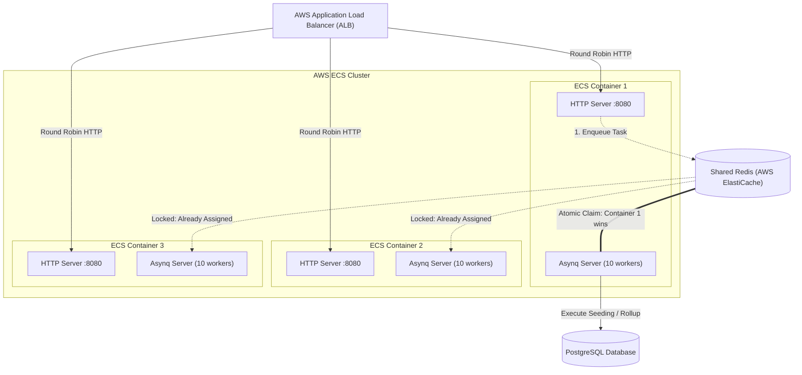

# Multi-Task ECS & ALB Deployment Guide

This guide explains how the asynchronous queue and background worker system behaves in **AWS ECS (Elastic Container Service)** when running behind an **Application Load Balancer (ALB)** with multiple container tasks.

---

## 1. The Core Question

> *"If we run our service in AWS ECS behind an ALB with multiple running tasks (e.g. 3, 5, or 10 containers), which task runs the queues and background jobs?"*

### Summary at a Glance:

| Component | Multiple ECS Tasks Behavior | Who Executes It? |
|---|---|---|
| **Incoming HTTP Request** | Round-robin / least connections routed by ALB | Exactly one container |
| **`DistributeTask...` (Enqueue)** | Writes JSON payload to shared Redis | Enqueued by the container handling the HTTP request |
| **Queue Task Execution** | **Competing Consumers** via Asynq + Redis | **Exactly ONE container** (Atomic Pop) |
| **Scheduled Cron Jobs** | **In-memory ticker** (`robfig/cron`) | **ALL containers** (unless guarded) |

---

## 2. Architecture Diagram



---

## 3. How Queue Tasks Run in Multi-Task ECS

All ECS tasks connect to the **same centralized Redis** (e.g., AWS ElastiCache for Redis).

1. When any container receives an HTTP request and calls:
   ```go
   s.distributor.DistributeTaskSeedElectionGroupStats(ctx, &payload)
   ```
   It writes the serialized task into the shared Redis cluster.
2. Every container runs an `asynq.Server` listening to that same Redis instance.
3. Asynq uses Redis atomic operations (`BRPOPLPUSH` / Lua scripts):
   - Whichever container has an available worker goroutine claims the task.
   - Redis atomically locks the task so no other container can pull it.
4. **Result**: Your background tasks are automatically and safely load-balanced across your entire ECS cluster. If you have 3 ECS tasks each with `Concurrency: 10`, you have a distributed pool of **30 workers**.

---

## 4. The Gotcha: In-Memory Cron Jobs

In [`worker.go`](file:///d:/Sz-projects/50-main-projects/3-free9ja/apps/api/internal/worker/worker.go):
```go
redisTaskProcessor.cron.AddFunc("5 0 * * *", redisTaskProcessor.ProcessDailyMarketingCampaignDeductions)
redisTaskProcessor.cron.AddFunc("*/15 * * * *", redisTaskProcessor.ProcessINECResultGrabberSync)
redisTaskProcessor.cron.Start()
```

Because `processor.cron` is an **in-memory Go scheduler** (`robfig/cron`), each running ECS container has its own clock:
- If 4 ECS tasks are running, at `00:05 AM`, **all 4 containers will execute `ProcessDailyMarketingCampaignDeductions` at the exact same second**, potentially processing duplicate deductions!
- Every 15 minutes, **all 4 containers will trigger `ProcessINECResultGrabberSync` simultaneously**.

---

## 5. Deployment Strategies in AWS ECS

### Strategy A: Split Architecture (Recommended for Production)

Run **two distinct ECS Services** from the same Docker image using an environment variable (e.g., `SERVICE_ROLE`):

```
                        ┌───> ECS Service 1: "free9ja-api" (Desired Count: 2 to 10)
                        │     - Attached to ALB
                        │     - Handles HTTP traffic only
                        │     - Calls distributor to enqueue jobs
                        │     - WORKER_ENABLED=false (skips processor.Start())
ALB ────────────────────┤
                        └───> ECS Service 2: "free9ja-worker" (Desired Count: 1 or 2)
                              - NO ALB / No public ports
                              - Runs processor.Start() + Crons
                              - Handles queue processing and scheduled jobs
```

#### Advantages:
1. **No Duplicate Crons**: Only the `free9ja-worker` service runs scheduled crons.
2. **Resource Isolation**: If an AI OCR task or 9,000-row database seeding task spikes CPU to 100%, **your HTTP API stays responsive** for end users.
3. **Independent Autoscaling**:
   - `free9ja-api` scales on HTTP Request Count or ALB Target Response Time.
   - `free9ja-worker` scales on Redis queue depth (number of pending jobs).

---

### Strategy B: Colocated Containers with Distributed Locks (Implemented)

When running a unified container service where containers handle both HTTP traffic and background jobs:

1. **Queue Jobs**: Handled natively across all containers by Asynq worker pools.
2. **Cron Jobs**: Both cron jobs are strictly protected against concurrent execution across multiple ECS containers:
   - **`ProcessDailyMarketingCampaignDeductions`**: Runs daily at 00:05 AM and on container boot (startup catch-up). Guarded by a 24-hour distributed lock on `cron:lock:marketing_deductions:YYYY-MM-DD` **and** database-level `last_deducted_date` idempotency. If an ECS task replacement happens at midnight and misses the cron tick, the newly booted container immediately processes the missed deduction.
   - **`ProcessINECResultGrabberSync`**: Guarded by a 14-minute distributed lock on `cron:lock:inec_grabber_sync` (`SetArgs` with `Mode: "NX"`), ensuring only one container polls INEC IReV every 15-minute interval. 

---

## 6. Checklist for Production ECS Deployments

- [ ] Ensure all ECS tasks point to the same **ElastiCache Redis** cluster (not `localhost`).
- [ ] Configure `asynq.Config.Concurrency` (default 10) appropriately based on ECS container vCPU/RAM.
- [ ] Set `asynq.Config.ShutdownTimeout` to match your ECS container stop timeout (default 30s) for graceful task completion.
- [x] Guard `ProcessDailyMarketingCampaignDeductions` using Redis `NX` distributed lock (`SetArgs`) and `last_deducted_date` idempotency + startup catch-up (Implemented).
- [x] Guard `ProcessINECResultGrabberSync` using Redis `NX` distributed lock (`SetArgs`) (Implemented).
