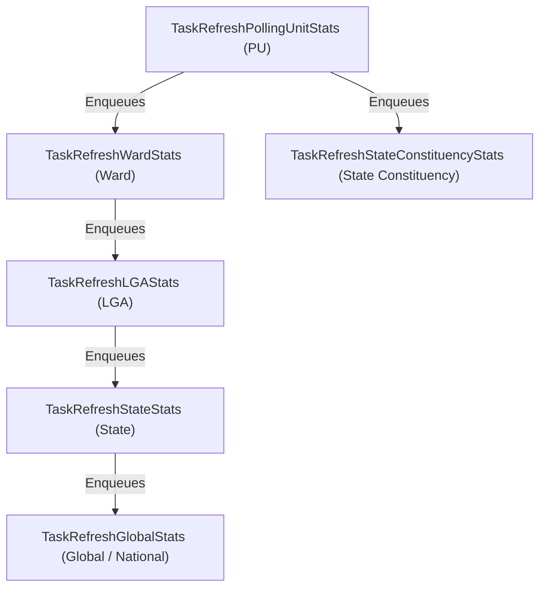
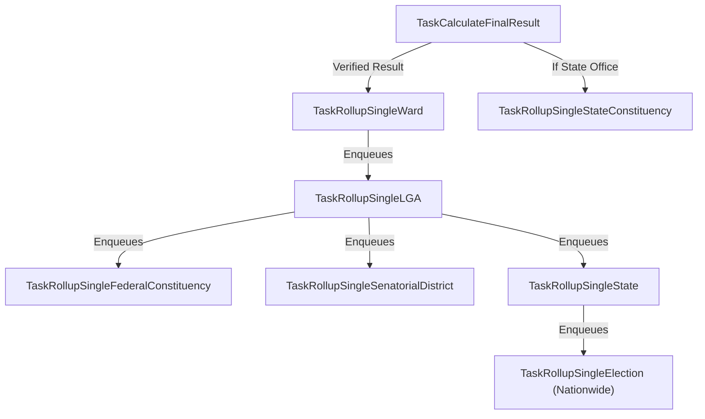

# Free9ja Worker Task Reference

This document catalogs all task types, payloads, debounce strategies, and execution flows in `apps/api/internal/worker`.

---

## Task Inventory

| Task Name Constant | Task Type String | Payload Struct | File | Debounce / Options |
|---|---|---|---|---|
| `TaskSeedElectionGroupStats` | `election_group:seed_stats` | `SeedElectionGroupStatsPayload` | [seed_election_stats_task.go](file:///d:/Sz-projects/50-main-projects/3-free9ja/apps/api/internal/worker/seed_election_stats_task.go) | 5s delay, 10m unique, 5 retries |
| `TaskAggregateLiveVotes` | `live_votes:aggregate` | `AggregateLiveVotesPayload` | [live_vote_task.go](file:///d:/Sz-projects/50-main-projects/3-free9ja/apps/api/internal/worker/live_vote_task.go) | 30s delay, 30s unique, 3 retries |
| `TaskRefreshPollingUnitStats` | `polling_unit:refresh_stats` | `RefreshPollingUnitStatsPayload` | [polling_unit_stats_task.go](file:///d:/Sz-projects/50-main-projects/3-free9ja/apps/api/internal/worker/polling_unit_stats_task.go) | 1m delay, 1m unique, 3 retries |
| `TaskRefreshWardStats` | `stats:refresh_ward` | `RefreshWardStatsPayload` | [stats_geo_tasks.go](file:///d:/Sz-projects/50-main-projects/3-free9ja/apps/api/internal/worker/stats_geo_tasks.go) | 2m delay, 2m unique, 3 retries |
| `TaskRefreshLGAStats` | `stats:refresh_lga` | `RefreshLGAStatsPayload` | [stats_geo_tasks.go](file:///d:/Sz-projects/50-main-projects/3-free9ja/apps/api/internal/worker/stats_geo_tasks.go) | 2m delay, 2m unique, 3 retries |
| `TaskRefreshStateConstituencyStats` | `stats:refresh_state_constituency` | `RefreshStateConstituencyStatsPayload` | [stats_geo_tasks.go](file:///d:/Sz-projects/50-main-projects/3-free9ja/apps/api/internal/worker/stats_geo_tasks.go) | 2m delay, 2m unique, 3 retries |
| `TaskRefreshStateStats` | `stats:refresh_state` | `RefreshStateStatsPayload` | [stats_geo_tasks.go](file:///d:/Sz-projects/50-main-projects/3-free9ja/apps/api/internal/worker/stats_geo_tasks.go) | 2m delay, 2m unique, 3 retries |
| `TaskRefreshGlobalStats` | `stats:refresh_global` | `RefreshGlobalStatsPayload` | [stats_geo_tasks.go](file:///d:/Sz-projects/50-main-projects/3-free9ja/apps/api/internal/worker/stats_geo_tasks.go) | 2m delay, 2m unique, 3 retries |
| `TaskCalculateFinalResult` | `final_result:calculate` | `CalculateFinalResultPayload` | [final_result_task.go](file:///d:/Sz-projects/50-main-projects/3-free9ja/apps/api/internal/worker/final_result_task.go) | 2m delay, 2m unique, 3 retries |
| `TaskExtractPUResultAI` | `pu_result:ai_extract` | `ExtractPUResultAIPayload` | [extract_pu_result_ai_task.go](file:///d:/Sz-projects/50-main-projects/3-free9ja/apps/api/internal/worker/extract_pu_result_ai_task.go) | Immediate, 3 retries, 60s timeout |
| `TaskRollupSingleWard` | `rollup:single_ward` | `RollupSingleWardPayload` | [candidate_rollup_tasks.go](file:///d:/Sz-projects/50-main-projects/3-free9ja/apps/api/internal/worker/candidate_rollup_tasks.go) | 15s delay, 15s unique, 3 retries |
| `TaskRollupSingleStateConstituency`| `rollup:single_state_constituency` | `RollupSingleStateConstituencyPayload` | [candidate_rollup_tasks.go](file:///d:/Sz-projects/50-main-projects/3-free9ja/apps/api/internal/worker/candidate_rollup_tasks.go) | 15s delay, 15s unique, 3 retries |
| `TaskRollupSingleLGA` | `rollup:single_lga` | `RollupSingleLGAPayload` | [candidate_rollup_tasks.go](file:///d:/Sz-projects/50-main-projects/3-free9ja/apps/api/internal/worker/candidate_rollup_tasks.go) | 15s delay, 15s unique, 3 retries |
| `TaskRollupSingleFederalConstituency` | `rollup:single_federal_constituency` | `RollupSingleFederalConstituencyPayload` | [candidate_rollup_tasks.go](file:///d:/Sz-projects/50-main-projects/3-free9ja/apps/api/internal/worker/candidate_rollup_tasks.go) | 15s delay, 15s unique, 3 retries |
| `TaskRollupSingleSenatorialDistrict` | `rollup:single_senatorial_district` | `RollupSingleSenatorialDistrictPayload` | [candidate_rollup_tasks.go](file:///d:/Sz-projects/50-main-projects/3-free9ja/apps/api/internal/worker/candidate_rollup_tasks.go) | 15s delay, 15s unique, 3 retries |
| `TaskRollupSingleState` | `rollup:single_state` | `RollupSingleStatePayload` | [candidate_rollup_tasks.go](file:///d:/Sz-projects/50-main-projects/3-free9ja/apps/api/internal/worker/candidate_rollup_tasks.go) | 15s delay, 15s unique, 3 retries |
| `TaskRollupSingleElection` | `rollup:single_election` | `RollupSingleElectionPayload` | [candidate_rollup_tasks.go](file:///d:/Sz-projects/50-main-projects/3-free9ja/apps/api/internal/worker/candidate_rollup_tasks.go) | 15s delay, 15s unique, 3 retries |

---

## 1. Top-Down Seeding Pipeline

### `election_group:seed_stats`
- **File**: [seed_election_stats_task.go](file:///d:/Sz-projects/50-main-projects/3-free9ja/apps/api/internal/worker/seed_election_stats_task.go)
- **Trigger**: Called in `ElectionGroupsService.CreateElectionGroup` after group creation.
- **Why it's delayed (5s)**: Gives the HTTP request or concurrent transaction time to insert member elections into PostgreSQL first.
- **Execution Order**:
  1. `SeedElectionGroupStateStats` (37 States + FCT)
  2. `SeedElectionGroupSenatorialDistrictStats` (109 Districts)
  3. `SeedElectionGroupFederalConstituencyStats` (360 Constituencies)
  4. `SeedElectionGroupLGAStats` (774 LGAs)
  5. `SeedElectionGroupStateConstituencyStats` (993 State Constituencies)
  6. `SeedElectionGroupWardStats` (~8,809 Wards)
- **Idempotency**: All SQL queries use `ON CONFLICT DO NOTHING`. Polling units (~176,846) are intentionally excluded and seeded lazily on demand.

---

## 2. Event-Driven Geographic Stats Cascade

Whenever an agent is assigned, an incident occurs, or live votes are submitted at a Polling Unit:

### Carry-Forward Optimization:
Notice that `RefreshWardStatsPayload` carries `LGAID` and `StateID`. When the Ward worker finishes aggregating, it enqueues the LGA task directly **without** having to query PostgreSQL to look up parent IDs.

---

## 3. Real-Time Candidate Rollup Cascade

When official or verified polling unit results are confirmed, votes must rollup strictly bottom-up to update candidate standings and broadcast live WebSocket updates:

At each step:
1. SQL aggregates child votes into the current administrative unit.
2. The `realtime.Broadcaster` fires a WebSocket event to live viewers.
3. The next ancestor in the administrative tree is enqueued with a 15s debounce.

---

## 4. AI Result Extraction

### `pu_result:ai_extract`
- **File**: [extract_pu_result_ai_task.go](file:///d:/Sz-projects/50-main-projects/3-free9ja/apps/api/internal/worker/extract_pu_result_ai_task.go)
- **Trigger**: An agent uploads a photo of an official INEC EC8A result sheet.
- **Action**:
  1. Sends image to Google Gemini Vision API.
  2. Prompts Gemini for structured JSON containing party short names, vote counts, agent name, and signature detection.
  3. Updates `polling_unit_results` record in PostgreSQL.
  4. Triggers `DistributeTaskCalculateFinalResult` to recalculate consensus.

---

## 5. Scheduled Safety-Net Crons

Embedded in [worker.go](file:///d:/Sz-projects/50-main-projects/3-free9ja/apps/api/internal/worker/worker.go#L113):

1. **Daily Marketing Campaign Deductions** (`5 0 * * *`):
   Runs at 00:05 AM every day to settle agent marketing allowances and auto-complete campaigns.
2. **INEC Result Grabber Sync** (`*/15 * * * *`):
   Runs every 15 minutes to poll the INEC IReV portal for newly published result sheets and enqueue reconciliation jobs.
3. **Sequential Full Election Rollup** (optional fallback cron):
   Periodically ensures full consistency across all regions even if a network partition or Redis failure occurred during real-time cascades.
